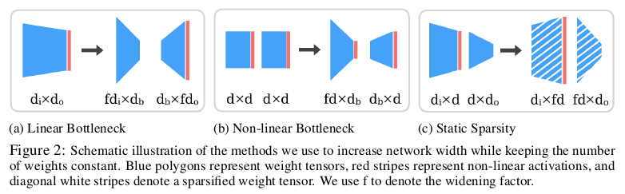
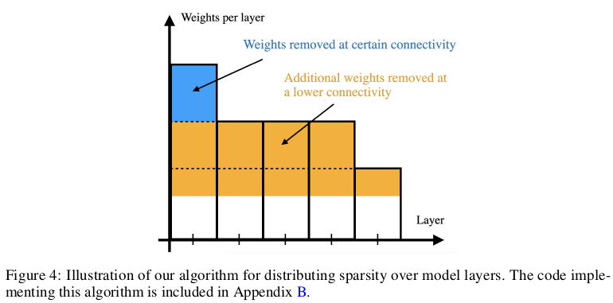
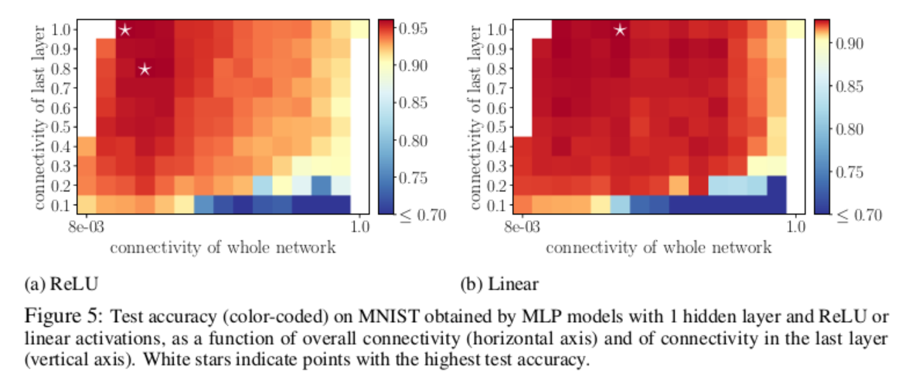
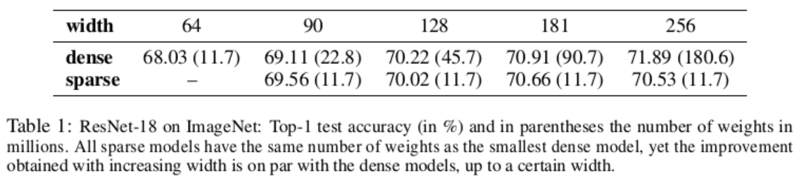
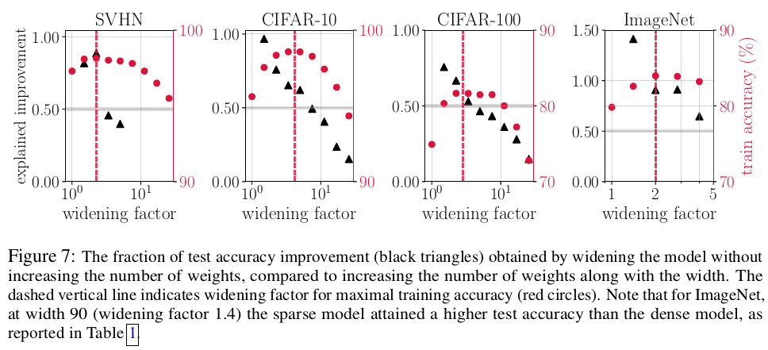

# Project task ideas

- Run models from sparsity experiment and try to replicate results
- Run models from sparsity experiment on different datasets
- Running the sparsity experiment on a different model -- the paper claims their hypothesis should hold true in general, we can test this
- Run models from sparsity experiment but modify parameter values and/or model architecture (ablation study)
- Running a similar experiment, such as widening different layers in the model rather than just the first one, or simply testing different widths/sparsities

# Paper notes

## 1 Abstract/Intro
- In most of these studies, the number of parameters is increased by increasing the network width. This begs the question: Is the observed improvement due to the larger number of **parameters**, or is it due to the **larger width** itself?
- We compare different ways of increasing model width while keeping the number of parameters constant.
### 1.1 Contributions
- 3 candidate methods for increasing newtwork width while keeping number of params constant:

- We find that test accuracy can be improved using method (a) or (c), while method (b) only degrades performance
- (a) suffers from another degradation caused by the reparameterization, even before widening the network
- (c) it leads to the best results and is applicable to any network type
- [Gaussian Process Kernels](https://scikit-learn.org/stable/modules/gaussian_process.html#gp-kernels): Gaussian Processes (GP) are a generic supervised learning method designed to solve regression and probabilistic classification problems. Kernels (also called “covariance functions” in the context of GPs) are a crucial ingredient of GPs which determine the shape of prior and posterior of the GP. They encode the assumptions on the function being learned by defining the “similarity” of two datapoints combined with the assumption that similar datapoints should have similar target values. Two categories of kernels can be distinguished: stationary kernels depend only on the distance of two datapoints and not on their absolute values 
 and are thus invariant to translations in the input space, while non-stationary kernels depend also on the specific values of the datapoints.

## 2 Empirical investigation
### 2.1 Methodology
- For a fully-connected layer, width is the number of *hidden units*, and for a convolutional layer, width corresponds to the number of *output channels*
- For the discussion in this paper, we focus on two model types: a MLP with one hidden layer, and a ResNet-18
- When creating a family of ResNet-18 models, we refer to the number of output channels of the first convolutional layer as the *width*, and do not alter the default width ratios of all following layers (i.e. only experiment with width of the first layer in ResNet-18)
## 2.2 Bottleneck methods
- Linear bottleneck: One can make the network wider by increasing the number of hidden units (d_i and d_o here) and reducing the bottleneck size d_b
- Non-linear bottleneck: The input dimension of the first layer is increased, while its output dimension (and consequently the input dimension of the second layer) is reduced (d_b < d)
- The results indicate that increasing width using the linear bottleneck indeed leads to improved accuracy up to a certain width. Moreover, this effect is more pronounced in smaller models
- The act of substituting a weight matrix by a product of two weight matrices changes the optimization trajectory which could in turn affect generalization
- The non-linear bottleneck method does not suffer from the same issues as the linear version in terms of inductive bias of reparametrization. However, no empirical improvement is obtained by increasing the width
## 2.3 Sparsity methods
- We start with a baseline model that has dense weight tensors. We then *increase the width* by a widening factor f and *sparsify* the weight tensors such that the total number of trainable weights *is the same* as in the baseline model.
- We define the **connectivity** of a sparse model to be the ratio between the *number of its parameters* and the *number of parameters in a dense model of the same width* (i.e. ratio should always be < 1 since sparse model has fewer params)
- To implement the sparsity method, we choose the number of weights to be removed in each layer to be proportional to the number of weights in that layer (except for BatchNorm layers, which are kept intact)

- MLP: At the optimal point the connectivity of the last layer is high, above 80%. It is therefore advantageous in this case to remove more weights from the first layer than from the last layer. This makes intuitive sense: Removing weights from a layer that starts out with fewer weights can be expected to make
optimization more difficult. This result motivates our choice to remove weights proportionally to layer size when sparsifying other models

- ResNet-18: We point out that test accuracy declines around the same width that training accuracy declines (see additional plots presented in Appendix E). Therefore, in this case the determining factor for model performance is width rather than number of parameters. 
- We find that performance improves with width at a fixed number of parameters, up to a certain widening factor. The effect is most pronounced for
more difficult tasks and for smaller models that do not reach 100% training accuracy, yet it is still present for models that do fit the training set

- The fraction of the improvement that can be attributed to width alone is the ratio between the *sparse/baseline accuracy gap* and the *dense/baseline
accuracy gap*. In other words, increasing width alone vs increasing width+params will both improve the model by some fraction of the baseline's accuracy. We compare these two fractional improvements by taking their ratio. A ratio of 1:1 indicates that increasing width alone is exactly as good as increasing width+params, x:1, x<1 means that only increasing width is x/1 times as good as increasing width+params **(if x>0.5, then most of the performance improvement can be attributed to increasing width)**, x>1 means that increasing width is x/1 times better than increasing width+params

## 3 Theoretical analysis
- In the infinite-width limit, the training dynamics of neural networks is equivalent under certain conditions to kernel-based learning
- We conjecture that the kernel of a finite-width network at initialization is indicative of its performance, and that optimal performance is achieved when its distance to the infinite-width kernel is minimized. We further hypothesize that this distance can be reduced by increasing the network width at a fixed number of parameters

## 4 Discussion
- Among the methods we tested, the one that led to the best results was removing weights at random in proportion to the layer size, using a static mask generated at initialization. In our image classification experiments, increasing the width using this sparsity method (while keeping the total number of parameters constant) led to significant improvements in model performance. The effect was strongest when starting with a narrow basline model
- Additionally, when comparing the wide, sparse models against dense models of the same width, we found that the width itself accounts for most of the performance gains; this holds true up to the width above which the training accuracy of the sparse models begins to deteriorate
- In our experiments we find that the optimal sparsity can be around 1-10% for convolutional models (corresponding to a widening factor of between 3-10). Therefore, using an implementation that natively supports sparse operations, our method may be used to build faster, more memory-efficient networks.

## Appendix
### D Sparsity distribution in Resnet-18
- When reducing the connectivity of a ResNet-18 model, we remove weights from each layer according to layer size. More precisely, we first remove weights from the layer with the largest number of weights until it reaches the size of the next-smaller layer. We then proceed with removing weights from these two layers equally, and continue this procedure until the targeted total number of weights in the network is achieved.